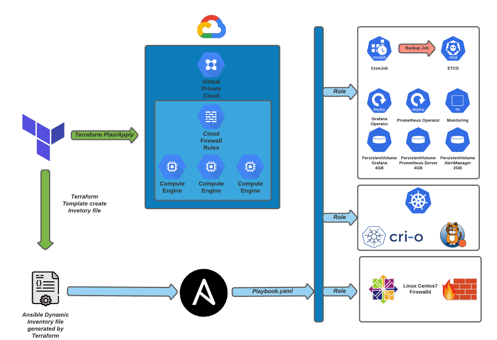

# Kubernetes Cluster on Google Cloud Plataform using Compute Engine

- Tecnologies
  - Terraform <terraform.io>
  - Ansible <www.ansible.com>
  - Kubernetes <kubernetes.io>
  - Calico Project <docs.projectcalico.org/getting-started/kubernetes/quickstart>
  - CRI-O <cri-o.io>

- Pre-req
  - CentOS 7 or 8 machine
  - JSON with Credentials of GCP to apply Terraform
  - 15GB free on each machine on GCP
  - Project on GCP
  - Bucket on GCP created to Backend (statefile)
  - SSH public key inserted on metadata of GCP

- Architecture



## Configuring Terraform

### backend configuration on main.tf

Before execute terraform init you will need store the statefile on backend, to do this will need Bucket created on GCP.

```json

terraform {
  backend "gcs" {
    bucket   = "name_of_buckek"
    prefix   = "terraform/state"
  }
}

```

### terraform.tfvars

terraform.tfvars contain all configuration of terraform, you can custom every parameter before execute plan/apply


#### VPC

| Name | Description | Type |
|------|-------------|------|
| auto\_create\_subnetworks | When set to true, the network is created in 'auto subnet mode' and it will create a subnet for each region automatically across the 10.128.0.0/9 address range. When set to false, the network is created in 'custom subnet mode' so the user can explicitly connect subnetwork resources. | `bool` |
| delete\_default\_internet\_gateway\_routes | If set, ensure that all routes within the network specified whose names begin with 'default-route' and with a next hop of 'default-internet-gateway' are deleted | `bool` |
| description | An optional description of this resource. The resource must be recreated to modify this field. | `string` |
| mtu | The network MTU. Must be a value between 1460 and 1500 inclusive. If set to 0 (meaning MTU is unset), the network will default to 1460 automatically. | `number` |
| network\_name | The name of the network being created | `any` |
| project\_id | The ID of the project where this VPC will be created | `any` |
| routing\_mode | The network routing mode (default 'GLOBAL') | `string` |
| shared\_vpc\_host | Makes this project a Shared VPC host if 'true' (default 'false') | `bool` |

#### SUBNET

| Name | Description | Type |
|------|-------------|------|
| network\_name | The name of the network where subnets will be created | `any` |
| project\_id | The ID of the project where subnets will be created | `any` |
| secondary\_ranges | Secondary ranges that will be used in some of the subnets | `map(list(object({ range_name = string, ip_cidr_range = string })))` |
| subnets | The list of subnets being created | `list(map(string))` |

#### FIREWALL

| Name | Description | Type |
|------|-------------|------|
| network\_name | Name of the network this set of firewall rules applies to. | `any` |
| project\_id | Project id of the project that holds the network. | `any` |
| rules | List of custom rule definitions (refer to variables file for syntax). | <pre>list(object({<br>    name                    = string<br>    description             = string<br>    direction               = string<br>    priority                = number<br>    ranges                  = list(string)<br>    source_tags             = list(string)<br>    source_service_accounts = list(string)<br>    target_tags             = list(string)<br>    target_service_accounts = list(string)<br>    allow = list(object({<br>      protocol = string<br>      ports    = list(string)<br>    }))<br>    deny = list(object({<br>      protocol = string<br>      ports    = list(string)<br>    }))<br>    log_config = object({<br>      metadata = string<br>    })<br>  }))</pre> |

#### COMPUTE ENGINE

```json

tags                                   = ["kubernetes"] // Tag to Firewall rules on GCP
instances                              = 2 // Number of instances on Compute Engine GCP
machine_type                           = "e2-medium" // Type of machine to create (hardware and resources)
type                                   = "pd-standard" // disk
size                                   = "20" //disk size
family                                 = "centos-7" // family of OS on GCP
project                                = "centos-cloud" // family of OS on GCP
hostname                               = "cka-node" // name and hostname of instance
startup_script                         = "sudo yum update -y && sudo yum upgrade -y" // Command to execute on startup of machine (ATENTION to this option, can broke the cluster on updates)

```

## Executing Terraform

On root folder of project, just execute this commands

```sh

make terraform-init

make terraform-plan

make terraform-apply

```

## Executing Ansible

Terraform create a host inventory file dynamically using temaples, you will need just run Ansible-playbook.

Before change the user of ssh user on group_vars

```sh

cd Ansible/group_vars/ 

vim kubernetes.yaml

linux_user: # Insert here the ssh user to run all playbooks.

```

This user need to be inserted on sudoers with no password on sudo. This configuration its default for cloud providers instances.

Now just run the ansible, on root folder of project

```sh

ansible-playbook -i Ansible/hosts Ansible/playbook.yaml 

```

## Get grafana user inside kubernetes cluster

```sh
#default user grafana -> admin

#password
kubectl get secret --namespace monitoring grafana-operator -o jsonpath="{.data.admin-password}" | base64 --decode ; echo

```

Important information, the default services of grafana and prometheus is ClusterIP on this project, to external access you will need change to NodePort or LoadBalancer.

Pods:

```sh

kubectl get pods --all-namespaces 
NAMESPACE         NAME                                                      READY   STATUS    RESTARTS   AGE
calico-system     calico-kube-controllers-7f58dbcbbd-n4tzq                  1/1     Running   0          90m
calico-system     calico-node-2b4zp                                         1/1     Running   0          89m
calico-system     calico-node-n7xzf                                         1/1     Running   0          90m
calico-system     calico-typha-76944b47d9-sznnh                             1/1     Running   0          89m
calico-system     calico-typha-76944b47d9-tn4ks                             1/1     Running   0          90m
kube-system       coredns-558bd4d5db-lfbbl                                  1/1     Running   0          90m
kube-system       coredns-558bd4d5db-nmxw6                                  1/1     Running   0          90m
kube-system       etcd-cka-node-1                                           1/1     Running   0          90m
kube-system       kube-apiserver-cka-node-1                                 1/1     Running   0          90m
kube-system       kube-controller-manager-cka-node-1                        1/1     Running   0          90m
kube-system       kube-proxy-fd7sz                                          1/1     Running   0          90m
kube-system       kube-proxy-qbxnc                                          1/1     Running   0          89m
kube-system       kube-scheduler-cka-node-1                                 1/1     Running   0          90m
monitoring        grafana-operator-7865594f84-n99fx                         1/1     Running   0          88m
monitoring        prometheus-operator-alertmanager-c74c85d66-x8g5q          2/2     Running   0          88m
monitoring        prometheus-operator-kube-state-metrics-56cd79c5b9-lqwtd   1/1     Running   0          88m
monitoring        prometheus-operator-node-exporter-mz69n                   1/1     Running   0          88m
monitoring        prometheus-operator-pushgateway-547c77db5f-ggzs5          1/1     Running   0          88m
monitoring        prometheus-operator-server-5999c5d54-z7cz5                2/2     Running   0          88m
tigera-operator   tigera-operator-86c4fc874f-4g2vv                          1/1     Running   0          90m

```

Services:

```sh

kubectl get svc --all-namespaces 
NAMESPACE       NAME                                     TYPE        CLUSTER-IP       EXTERNAL-IP   PORT(S)                  AGE
calico-system   calico-kube-controllers-metrics          ClusterIP   10.102.212.175   <none>        9094/TCP                 90m
calico-system   calico-typha                             ClusterIP   10.96.78.197     <none>        5473/TCP                 91m
default         kubernetes                               ClusterIP   10.96.0.1        <none>        443/TCP                  91m
kube-system     kube-dns                                 ClusterIP   10.96.0.10       <none>        53/UDP,53/TCP,9153/TCP   91m
monitoring      grafana-operator                         ClusterIP   10.101.123.25    <none>        80/TCP                   89m
monitoring      prometheus-operator-alertmanager         ClusterIP   10.111.22.195    <none>        80/TCP                   89m
monitoring      prometheus-operator-kube-state-metrics   ClusterIP   10.102.245.87    <none>        8080/TCP                 89m
monitoring      prometheus-operator-node-exporter        ClusterIP   None             <none>        9100/TCP                 89m
monitoring      prometheus-operator-pushgateway          ClusterIP   10.109.106.185   <none>        9091/TCP                 89m
monitoring      prometheus-operator-server               ClusterIP   10.103.74.130    <none>        80/TCP                   89m

```

CronJob to backup ETCD

```sh

kubectl get cronjobs.batch -n kube-system 
NAME          SCHEDULE      SUSPEND   ACTIVE   LAST SCHEDULE   AGE
backup-etcd   30 14 * * 3   False     0        <none>          89m

```
